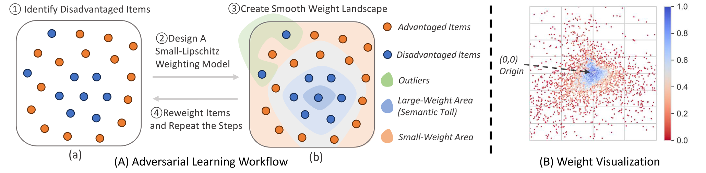

# Promotion of Semantic Item Tail via Adversarial Learning ( KDD-EAI 2024 )



## Introduction
This is the implementation of  "Promotion of Semantic Item Tail via Adversarial Learning" published in KDD-EAI 2024.

In this paper, we focus mainly on the popularity bias, which is a particular type of bias where a recommender system recommends many popular items at a possible disadvantage to many other relevant items. The unpopular items, while have less user interaction, constitute the majority of the catalog and are typically referred to as the long tail of the catalog.  Promoting such infrequent items from the long tail is potentially crucial to users' satisfaction and a higher chance of success to every item. Different from the popular items, these infrequent items can coincide with the personalized taste, they can provide unexpected experience other than the mainstream popularity, motivate  users to explore deeper into the catalog and evoke a sense of freshness~\cite{unexpected}. On the supply side of items, many more items get a chance to succeed on the platform such that a handful of minority items do not suppress the chance of a vast majority of items.

We find we not only improve the performance but also improves the coverage and general diversity of the recommendation results.


## Get the preprocessed data

We follow the way of EASE by preparing the dataset into implicit feedback setting, as this is the most common in industrial setting. To download our pre-processed data, please use this  and decompress it into data folder.

## How to Use

In the common datasets, we provide a one-stop shop for all the methods including Ours, IPW, EASE and Tail Optimization and all datasets including Movielens20, Netflix Prize and MSD. The main body is written in train_body.py. 

To use it, simply run train_body.py. In main function, you could specify the concrete parameters to reproduce the result.

The parameters required to reproduce our results.

|Dataset|Params|
|-----|-----|
|MovieLens |	ml20m_ease_lr2.00e+00_alr1.00e+00_wd8.00e-06_nstd1.50e+00_awd0.00e+00_ast2bmlp2_alossrecall_dist_onesFalse_lam1.00e+00_l2_itemarl_metric |
|Netflix Prize |nflx_ease_lr1.00e+00_alr1.00e+00_wd5.00e-05_nstd1.00e+00_awd0.00e+00_ast2mlp50_alossrecall_dist_onesFalse_lam1.00e+00_l2_itemarl_metric |
|Million Song | msd_ease_lr4.00e+01_alr1.00e-01_wd1.00e-05_nstd5.00e-01_awd1.00e-05_ast2mlp2_alossrecall_onesTrue_lam1.00e+00_l2_itemarl_metric|


You can fill these parameters in train_body.py or jupyter notebook and invoke train_body function to train.

## Dependency

The program will auto run on GPU if the device is avaiable and on CPU otherwise.
It requires pytorch. We modified the python package recsys_metrics https://github.com/zuoxingdong/recsys_metrics for evaluation.

## Citation

If you find this project useful, please cite us

```
@misc{xu2023posit,
      title={POSIT: Promotion of Semantic Item Tail via Adversarial Learning}, 
      author={Qiuling Xu and Pannaga Shivaswamy and Xiangyu Zhang},
      year={2023},
      eprint={2308.03366},
      archivePrefix={arXiv},
      primaryClass={cs.IR}
}
```

## Result

| Dataset | Method | Coverage@k Top 100 | Coverage@k Top 50 | Coverage@k Top 20 | NDCG@K Top 100 | Recall@K Top 100 | Recall@K Top 50 | Recall@K Top 20 | Item Recall@k Top 100 | Item Recall@k Top 50 | Item Recall@k Top 20 |
|---------|--------|------------------|-----------------|-----------------|--------------|----------------|---------------|---------------|---------------------|--------------------|--------------------|
| Movie Lens | POSIT | 1793 | 1052 | 530 | 0.4214 | 0.6369 | 0.5244 | 0.3928 | 0.0465 | 0.0294 | 0.0146 |
| Movie Lens | IPW | 1531 | 972 | 519 | 0.4209 | 0.6364 | 0.5226 | 0.3926 | 0.0433 | 0.0270 | 0.0131 |
| Movie Lens | CVar | 1488 | 940 | 502 | 0.4200 | 0.6353 | 0.5210 | 0.3911 | 0.0426 | 0.0262 | 0.0127 |
| Movie Lens | Rerank | 1718 | 948 | 490 | 0.4190 | 0.6300 | 0.5199 | 0.3906 | 0.0419 | 0.0257 | 0.0123 |
| Movie Lens | EASE | 1461 | 922 | 489 | 0.4199 | 0.6356 | 0.5209 | 0.3906 | 0.0419 | 0.0257 | 0.0123 |
| Movie Lens | Causal | 1084 | 417 | 259 | 0.3695 | 0.5599 | 0.4560 | 0.3411 | 0.0143 | 0.0083 | 0.0041 |
| Movie Lens | Post | 1586 | 922 | 489 | 0.3927 | 0.5525 | 0.4448 | 0.4118 | 0.0419 | 0.0257 | 0.0123 |
| Movie Lens | MP | 100 | 50 | 20 | 0.1905 | 0.3300 | 0.2351 | 0.1617 | 0.0067 | 0.0035 | 0.0016 |
| Standard Deviation | | ±10 | ±5 | ±2 | ±0.0009 | ±0.0009 | ±0.0009 | ±0.0009 | ±0.0004 | ±0.0004 | ±0.0004 |
| Netflix Prize | POSIT | 1968 | 1256 | 694 | 0.3953 | 0.5565 | 0.4472 | 0.3633 | 0.0958 | 0.0631 | 0.0342 |
| Netflix Prize | IPW | 1802 | 1179 | 670 | 0.3942 | 0.5560 | 0.4464 | 0.3625 | 0.0833 | 0.0526 | 0.0269 |
| Netflix Prize | CVar | 1795 | 1177 | 667 | 0.3933 | 0.5537 | 0.4449 | 0.3617 | 0.0842 | 0.0532 | 0.0271 |
| Netflix Prize | Rerank | 1950 | 1190 | 655 | 0.3919 | 0.5478 | 0.4435 | 0.3612 | 0.0802 | 0.0502 | 0.0252 |
| Netflix Prize | EASE | 1762 | 1153 | 654 | 0.3930 | 0.5541 | 0.4448 | 0.3613 | 0.0804 | 0.0502 | 0.0252 |
| Netflix Prize | Causal | 1394 | 962 | 564 | 0.3551 | 0.5034 | 0.4024 | 0.3233 | 0.0251 | 0.0468 | 0.0249 |
| Netflix Prize | Post | 1759 | 1155 | 654 | 0.3927 | 0.5525 | 0.4448 | 0.3612 | 0.0777 | 0.0468 | 0.0249 |
| Netflix Prize | MP | 100 | 50 | 20 | 0.1587 | 0.2743 | 0.1749 | 0.1161 | 0.0083 | 0.0044 | 0.0019 |
| Standard Deviation | | ±6 | ±4 | ±2 | ±0.0009 | ±0.0009 | ±0.0009 | ±0.0009 | ±0.0004 | ±0.0004 | ±0.0004 |
| Million Song | POSIT | 6569 | 3692 | 1625 | 0.3915 | 0.5116 | 0.4290 | 0.3341 | 0.2479 | 0.2030 | 0.1433 |
| Million Song | IPW | 6466 | 3673 | 1626 | 0.3909 | 0.5099 | 0.4290 | 0.3340 | 0.2464 | 0.2018 | 0.1419 |
| Million Song | CVar | 6337 | 3556 | 1567 | 0.3839 | 0.5070 | 0.4240 | 0.3268 | 0.2401 | 0.1917 | 0.1314 |
| Million Song | Rerank | 6368 | 3624 | 1609 | 0.3896 | 0.5062 | 0.4278 | 0.3339 | 0.2444 | 0.2007 | 0.1412 |
| Million Song | EASE | 6304 | 3623 | 1609 | 0.3898 | 0.5084 | 0.4279 | 0.3339 | 0.2445 | 0.2007 | 0.1412 |
| Million Song | Causal | - | - | - | - | - | - | - | - | - | - |
| Million Song | Post | 6342 | 3632 | 1611 | 0.3899 | 0.5072 | 0.4279 | 0.3340 | 0.2453 | 0.2013 | 0.1416 |
| Million Song | MP | 100 | 50 | 20 | 0.0582 | 0.0986 | 0.0680 | 0.0427 | 0.0027 | 0.0018 | 0.0010 |
| Standard Deviation | | ±9 | ±5 | ±2 | ±0.0009 | ±0.0009 | ±0.0009 | ±0.0009 | ±0.0004 | ±0.0004 | ±0.0004 |